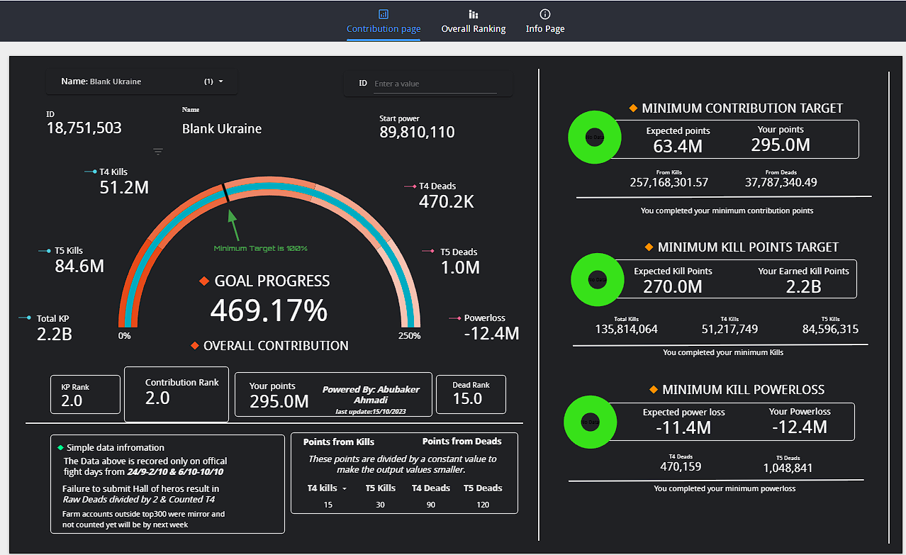
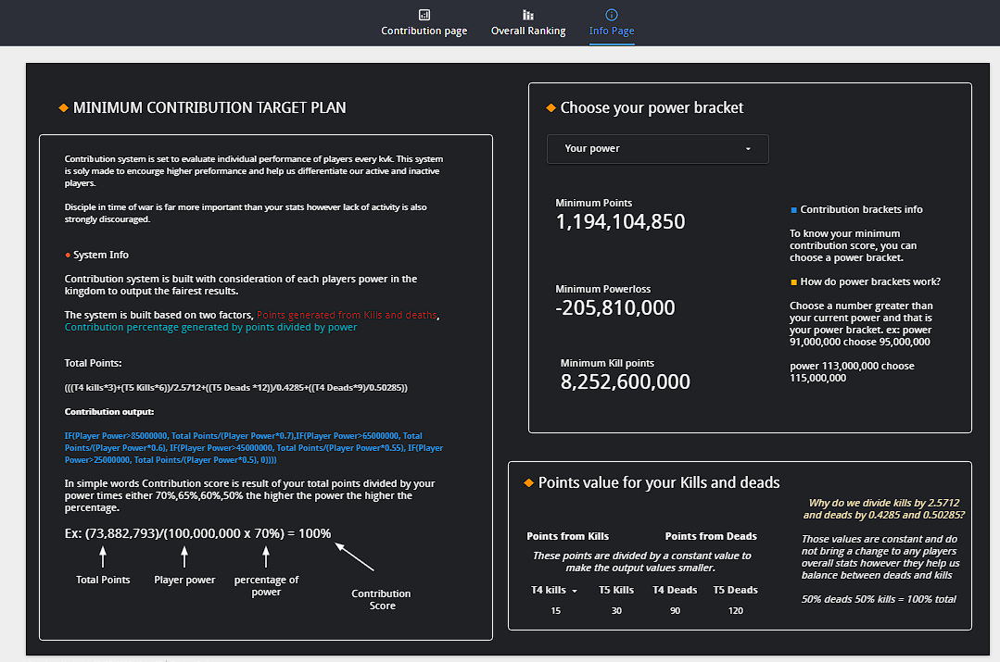

# 📊 Team Performance Dashboard — Google Looker Studio

This project showcases a live performance dashboard built using **Google Looker Studio** to monitor and analyze the progress of a 300-person team over the course of a 2-month organizational event.

## 🔍 Project Overview

The dashboard was developed to provide clear, real-time insights into:
- ✅ Task completion rates
- 📅 Attendance and participation
- 📊 Team engagement and consistency
- 🧠 Performance tier breakdowns and KPIs

It was essential for supporting leadership decisions, identifying areas needing attention, and celebrating achievements across departments.

## 🛠️ Tools & Technologies

- **Google Sheets** — Source of structured data
- **Google Apps Script** — Automated data transformation
- **Google Looker Studio** — Interactive dashboards and visualizations
- **GitHub Pages** — Public web hosting for project documentation

## 🌐 Live Demo

👉 [View the Live Dashboard](https://lookerstudio.google.com/embed/reporting/fa491e7e-089e-4982-829b-52f9292f0ccf/page/p_jzf7a8ctad)

> *Note: The dashboard is embedded directly from Looker Studio and updates automatically when the source data changes.*

## 📌 Use Case

This solution was used by event organizers to:
- Track 300 individual contributors and departments
- Evaluate engagement throughout a large-scale campaign
- Align strategic actions with live insights

## 📷 Screenshots

## 📁 Project Structure

